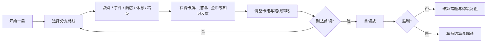
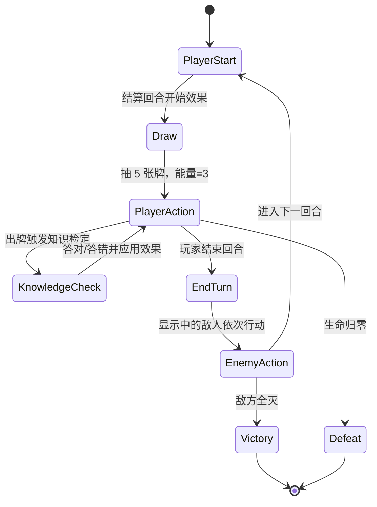

# 《文脉尖塔》PRD

- **文档状态**：Draft v0.1
- **产品类型**：2D 像素风、单机、回合制卡牌构筑、路线式冒险
- **目标平台**：Windows / macOS 电脑端
- **项目规模**：个人练手；先做一个可完成的垂直切片
- **Studio 收口人**：`producer-director`
- **玩法负责人**：`gameplay-lead`
- **内容负责人**：`content-lead`
- **视觉负责人**：`art-audio-lead`
- **技术与质量负责人**：`tech-quality-lead`

## 1. 产品概述

《文脉尖塔》是一款以初中语文知识为主题的路线式卡牌构筑冒险游戏。玩家扮演“拾文者”，在逐层崩解的文脉塔中前进，通过组建卡组、判断敌人意图、选择路线和解决语文知识情境，击败章节首领并修复一篇失落的文章。

核心体验参考卡牌构筑冒险类型的成熟结构：随机地图、分支路线、回合制战斗、抽牌与弃牌、卡牌升级、遗物、事件、商店、精英和首领。参考的是机制与节奏，所有角色、文本、图标、场景、数值和代码均为原创。

## 1.1 机制参考映射

| 卡牌构筑冒险惯例 | 《文脉尖塔》的实现 |
|---|---|
| 每局随机路线 | 15–18 层、可见分支、固定首领前节点、运行种子复现 |
| 回合制资源约束 | 每回合 3 能量、抽 5 张牌、未用能量不保留 |
| 敌人意图 | 敌人行动前显示攻击、防御、增益或特殊行为图标与数值 |
| 战斗后奖励 | 三选一卡牌、金币、少量恢复或特殊资源；允许跳过卡牌 |
| 被动构筑组件 | 遗物提供跨卡牌、跨战斗的被动联动 |
| 路线风险 | 普通战斗、精英、事件、商店、休息和未知节点共存 |
| 章节高潮 | 每章一个首领，首领拥有阶段变化和可读的行动规律 |
| 消耗品 | “墨符”作为有限使用的战斗外/战斗内道具，不进入卡组 |
| 长期进度 | 只解锁新卡、遗物和知识包，不提高基础数值，保持每局决策重要 |

这些映射用于复现该类型的决策密度和节奏，不复制任何具体卡牌、敌人或数值表。

参考基线： [Steam 上《Slay the Spire》的官方功能说明](https://store.steampowered.com/app/646570/Slay_the_Spire/?l=english) 所列的动态构筑、变化地图和遗物联动。

## 2. 产品目标

1. 让玩家在追求构筑强度时，自然重复使用初中语文知识。
2. 用清晰的敌人意图和路线风险，让每一局都产生可解释的决策。
3. 在个人可控的范围内完成一个 20–40 分钟可通关的章节。
4. 建立可扩展的题库、卡牌、敌人和事件数据管线。

### 非目标

- 不做多人、联网、竞技、抽卡付费或大型开放世界。
- 不把游戏做成题库答题器；知识题只作为战斗和事件决策的一部分。
- 不复制《杀戮尖塔》的具体角色、敌人、图标、卡牌文本、UI 排版、场景构图或美术素材。

## 3. 目标玩家与使用场景

- **主要玩家**：正在学习或复习初中语文的学生；喜欢轻量策略和重复挑战的玩家。
- **次要玩家**：想体验语文主题独立游戏的成年人。
- **单次会话**：10–45 分钟；一次完整冒险约 30–60 分钟。
- **操作方式**：鼠标为主，键盘快捷键；后续增加手柄。

## 4. 体验支柱

| 支柱 | 设计要求 |
|---|---|
| 构筑有意义 | 每次奖励至少提供一个会改变后续打法的选择 |
| 读懂再决策 | 敌人意图、费用、状态和知识反馈必须一眼可读 |
| 知识有回报 | 答对让卡牌更强、路线更安全或奖励更好；答错不让玩家立即失去整局 |
| 风险可判断 | 精英、事件和捷径提供高收益，同时明确代价 |
| 失败能学习 | 结算展示错题、薄弱知识点和本局关键决策 |

## 5. 核心游戏循环

## 6. 单局规则

### 6.1 初始状态

- 初始生命：70
- 初始能量：3
- 初始卡组：10 张（5 张“识文”攻击、4 张“守意”防御、1 张“提纲”技能）
- 每回合抽牌：5 张
- 回合结束：手牌进入弃牌堆；未用能量不保留
- 抽牌堆耗尽时，将弃牌堆洗回抽牌堆
- 战斗胜利：获得金币、卡牌奖励和少量“文识”经验

### 6.2 战斗回合

### 6.3 语文检定

- 不是每张卡都弹题；只有标记为 `knowledge_check` 的卡牌会触发。
- 题目必须在战斗上下文中有意义，例如“辨析病句”决定削弱敌方意图，“古诗文理解”决定护盾转化为反击。
- 玩家有 8 秒思考时间，题面最多 60 字，选项最多 4 个。
- **答对**：获得卡牌的强化效果，并获得 1 层“洞见”。
- **答错**：执行基础效果，并获得 1 层“疑滞”；不会直接结束回合。
- 连续答对可以触发卡牌的“连章”效果；连续答错会让本回合后续检定只执行基础效果。
- 每场战斗最多触发 2 次知识检定；超过上限的知识卡只执行基础效果，避免战斗变成连续答题。
- 无障碍模式可以取消倒计时；取消倒计时不改变答案判定或卡牌效果。
- 战斗结束展示错题、解析和复习标签。

### 6.3.1 战斗时序与结算顺序

1. 战斗开始：建立战斗种子、洗牌、抽取初始手牌，敌人生成第一条意图。
2. 玩家回合开始：结算回合开始遗物和状态，能量恢复为 3，抽 5 张牌。
3. 玩家出牌：检查费用与目标，锁定目标快照；若卡牌有检定且本场仍有检定额度，则进入题目流程。
4. 效果解析：先执行卡牌基础效果，再执行答题强化/惩罚，最后触发“出牌后”和“受击后”效果。
5. 玩家结束回合：手牌进入弃牌堆；标记 `exhaust` 的牌进入消耗堆；结算回合结束状态和遗物。
6. 敌人回合开始：锁定并展示下一条意图，按敌人队列依次执行；每个敌人行动后检查死亡和触发器。
7. 敌人回合结束：更新持续状态和遗物，进入下一次玩家回合。
8. 战斗结束：胜利时生成奖励快照；失败时保存战斗日志并进入复盘页。

玩家可以看到敌人意图，但意图生成由随机种子和敌人策略决定；同一运行种子与相同输入应得到相同结果。

### 6.4 状态

| 状态 | 作用 |
|---|---|
| 洞见 | 每层使下一张知识卡的强化效果提高 10%，最多 3 层 |
| 疑滞 | 每层使本回合受到伤害提高 5%，回合结束减少 1 层 |
| 破绽 | 受到攻击伤害提高；来自“语病/逻辑”主题卡牌 |
| 护意 | 抵消伤害；部分卡牌可将剩余护意转为反击 |
| 章法 | 让技能卡获得额外费用折扣或抽牌 |

### 6.5 奖励、遗物与墨符

- 战斗胜利后展示 3 张不同稀有度倾向的卡牌，玩家可以选择 1 张或跳过。
- 精英必定掉落 1 件遗物；首领掉落章节遗物并开放下一章节。
- 遗物是被动效果，不占卡组空间；效果应能改变至少一种卡牌或路线决策。
- 商店提供 3 张卡牌、2 件遗物、1 次卡牌移除和 2 个墨符槽位。
- 墨符是一次性消耗品，最多携带 3 个；首个切片只做“重抽一张牌”“净化 1 层疑滞”“查看下一次敌人意图”三种。
- 休息点在“恢复 30% 最大生命”和“升级一张卡牌”之间二选一。

## 7. 卡牌系统

### 7.1 卡牌类别

- **识文（攻击）**：识字、辨音、词义等知识主题；造成直接伤害。
- **守意（防御）**：句意、篇章结构、阅读策略；提供护意、格挡或净化。
- **章法（技能）**：古诗文、文言文、修辞和结构；改变抽牌、费用或状态。
- **引经（能力）**：名著与经典意象；提供持续效果，通常每场只能打出一次。
- **问答（知识检定）**：在战斗中打开短题目，答对后改变整回合节奏。

### 7.2 卡牌设计约束

每张卡必须包含：唯一 ID、名称、费用、类别、稀有度、目标、基础效果、强化效果、知识标签、升级效果、简短文本、来源和审核状态。

卡牌奖励必须让玩家在“立即强度、未来协同、卡组稀释”之间做选择。卡牌可升级一次；删除卡牌需要付出金币或事件代价。

### 7.3 初始流派

| 流派 | 关键知识 | 玩法特征 |
|---|---|---|
| 字音连击 | 字音字形、词语 | 低费多段攻击，答对后连击叠加 |
| 章法护意 | 病句、篇章结构 | 防御转攻击，靠护意和费用折扣滚雪球 |
| 古文蓄势 | 古诗文、文言文 | 少量高费卡，先蓄“章法”再爆发 |

## 8. 地图与节点

地图由 15–18 层节点组成，每层提供 2–4 个可见后续节点；路线不可完全回退。节点类型：

- **普通战斗**：低风险，提供基础卡牌奖励。
- **精英战斗**：高风险，保证掉落遗物。
- **事件**：阅读一段情境后，在 2–3 个有代价的选项中选择。
- **商店**：购买卡牌、遗物、移除卡牌或恢复少量生命。
- **休息点**：恢复生命或升级一张卡牌。
- **未知节点**：随机事件、奖励或特殊战斗。
- **首领**：章节终点，拥有可读的多阶段意图。

## 9. 章节与叙事

首个章节名为 **“失序的字海”**：文脉塔的字词层发生错位，敌人由“错别字”“歧义影”“断章兽”组成，首领为会改写敌方意图的“乱章官”。

剧情只承担三个功能：解释路线目标、赋予知识主题以情境、为胜负提供情绪反馈。战斗文本优先使用短句和图标，避免长段落遮挡操作信息。

## 10. 视觉与音频方向

### 10.1 风格目标

采用原创的复古 2D 像素美术：低分辨率硬边像素、有限色板、清晰剪影、逐帧攻击与命中特效、纸张和墨色的主题材质、带手工感的像素字体与图标。整体气质是“古籍书页 + 破碎文脉 + 奇幻冒险”。

### 10.2 风格边界

可以参考同类作品的像素化、夸张轮廓、战斗特效节奏和信息密度，但不得复用其具体角色形状、敌人轮廓、卡牌构图、UI 组件、字体、图标、配色组合或场景布局。所有资源从原创草图和原创像素资产开始。

每次资源评审增加原创性检查：角色剪影、敌人姿态、卡牌版式、图标语义组合、字体比例、按钮位置、背景构图和特效形状不得与参考作品形成可替换的逐项对应关系。

### 10.3 信息编码

- 卡牌稀有度：边框材质和角标区分。
- 敌人意图：攻击、护盾、增益、特殊行为使用稳定图标。
- 语文反馈：答对为青绿色“洞见”，答错为赭红色“疑滞”，同时提供文字标签，不只依赖颜色。
- 危险提示：使用闪烁、音效和轮廓，不使用过度屏闪。

## 11. 学习反馈

每局结束生成复盘页：

- 正确率、平均答题时间、知识标签分布；
- 错题原文、正确答案、简明解析和复习建议；
- 哪些卡牌因答对而改变了战斗结果；
- “再试一次”入口，使用同知识点的新题而非直接重复原题。

学习指标用于改进题目和反馈，不用于排行榜或惩罚玩家。

## 12. 首个垂直切片范围

首个可玩版本采用 **Slice A**，先验证闭环；通过后再扩展为完整章节。

| 内容 | Slice A | 完整章节目标 |
|---|---:|---:|
| 地图层数 | 8–10 | 15–18 |
| 普通敌人 | 2 | 3 |
| 精英 | 1 | 1 |
| 首领 | 1 | 1 |
| 卡牌 | 12–16 | 20–30 |
| 遗物 | 3–4 | 6–10 |
| 事件 | 2–3 | 5–8 |
| 知识类型 | 2 | 3 |
| 单局时长 | 15–25 分钟 | 20–40 分钟 |

垂直切片的通过条件：玩家能完成一条路线；至少形成两种不同构筑；知识检定不打断战斗节奏；失败后能看懂原因并复习错题。扩展章节前，Slice A 必须在 10 个固定种子中至少有 7 个可完成首领战。

## 13. 版本验收指标

- 首次进入战斗后 60 秒内理解费用、抽牌、敌人意图和结束回合。
- 试玩者在不看说明的情况下，能说出至少两种路线节点的差异。
- 20 局内部测试中，三种初始流派都至少有一条可行路线。
- 题目答案、解析、年级和来源字段 100% 完整。
- 关键 UI 在目标分辨率下无文字截断、遮挡或仅靠颜色传达的信息。
- 存档、退出、恢复和失败结算流程可重复验证。

## 14. 风险与决策

| 风险 | 应对 |
|---|---|
| 题目变成战斗外的打断 | 只让部分卡触发检定；限制题面长度和答题时间 |
| 知识奖励导致唯一最优答案 | 强化效果提供方向，不直接决定胜负；保留基础效果 |
| 内容量超出个人能力 | 先锁定一个章节和三类知识，所有内容数据化 |
| 视觉过度接近参考作品 | 建立原创色板、材质、角色剪影和 UI 组件库，逐项审查 |
| 数值难以平衡 | 记录随机种子、构筑日志和战斗结果，使用小规模模拟 |
