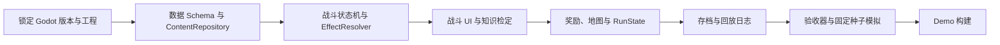
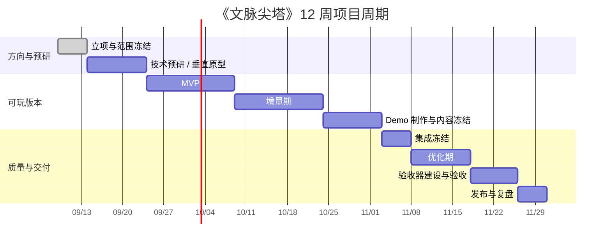
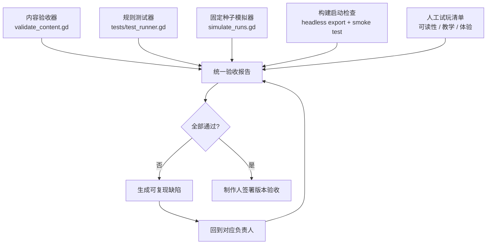
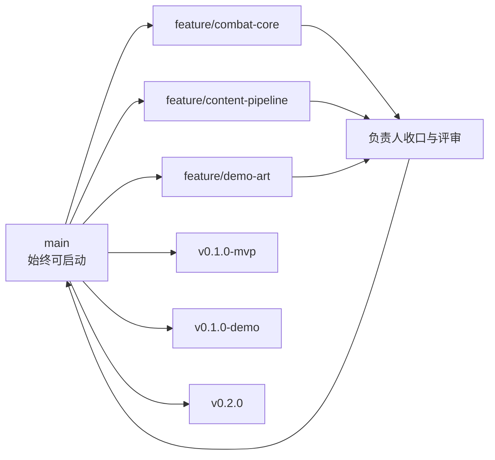

# 《文脉尖塔》项目周期计划

- **文档状态**：Draft v0.1
- **基线文档**：[PRD.md](PRD.md)、[TDD.md](TDD.md)
- **项目形态**：个人练手；Godot 4.x；Windows / macOS；单机本地存档
- **计划基线**：12 周；每周投入 10–15 小时。投入不同可按比例拉长，不改变阶段门。
- **总负责人**：`producer-director`
- **技术与质量收口**：`tech-quality-lead`

## 1. 当前技术与产品判断

当前仓库已经有 PRD、TDD、Studio 章程和可调用 Skill，但还没有 `project.godot`、游戏场景、运行时代码、题库数据、资源包、测试脚本或导出构建。因此项目处于 **设计完成 / 工程未启动** 阶段。

TDD 的技术方向适合个人项目：Godot 4.x、GDScript、数据驱动、固定随机种子、本地存档和无头测试。真正的关键依赖顺序是：

以下依赖不是 MVP 的前置条件，可以后置：复杂元进度、多章节、完整手柄、联网、排行榜、完整音频系统和大量题库。

## 2. 需要新增的阶段

除了用户指定的 MVP、增量期、Demo、优化期和验收器，建议加入四个阶段：

| 新阶段 | 为什么需要 | 主要结果 |
|---|---|---|
| 立项与范围冻结 | 防止个人项目在内容、美术和系统上失控 | 目标、非目标、Slice A 清单和版本门 |
| 技术预研 / 垂直原型 | 在生产内容前验证状态机、数据加载和答题暂停 | 可运行的单战斗原型 |
| 集成冻结 | 避免 Demo 期间玩法、数据和资源持续互相破坏 | 内容锁定、接口锁定、候选构建 |
| 发布与复盘 | 让这次练手变成可复用的开发资产 | 发布包、问题清单、下一版本决策 |

## 3. 12 周周期总览

日期是计划基线，不是硬性发布日期；阶段顺序和退出条件比日期更重要。

## 4. 阶段计划与退出条件

### 阶段 0：立项与范围冻结（第 1 周）

**目标**：把 PRD/TDD 变成可以开始开发的任务边界。

**任务**

- `producer-director` 锁定 Slice A：8–10 层、2 个普通敌人、1 个精英、1 个首领、12–16 张卡、3–4 件遗物、2–3 个事件、2 类知识。
- `gameplay-lead` 锁定战斗时序、奖励流程、卡牌类别和三种状态的首版规则。
- `content-lead` 选定首批知识范围，建立题目审核模板和来源字段。
- `art-audio-lead` 锁定 640×360 逻辑画布、像素尺寸、色板、字体和占位资源规格。
- `tech-quality-lead` 创建任务板、依赖清单、风险清单和 Git 分支约定。

**交付物**：版本目标、一页式范围说明、首批任务卡、资源清单、决策记录。

**退出条件**：任何新增任务都能归入既定范围；没有未决的核心回合规则或数据字段。

### 阶段 1：技术预研 / 垂直原型（第 1–2 周）

**目标**：证明最危险的技术链能跑通。

**任务**

- 创建 Godot 4.4.x 工程，固定具体 patch 版本并记录导出模板。
- 建立 `project.godot`、Autoload、目录结构、InputMap 和 640×360 viewport。
- 实现 `ContentRepository`，加载 1 张卡、1 个敌人、3 道题和 3 个效果命令。
- 实现 `TurnStateMachine`：抽牌、费用、出牌、结束回合、敌人意图和胜负。
- 实现题目异步暂停、答对/答错/超时和最多 2 次检定额度。
- 建立最小战斗 UI、调试日志和一个固定随机种子。

**交付物**：可启动工程、单战斗原型、数据校验入口、第一份战斗日志。

**退出条件**：从启动到胜负可以完整运行；同一种子与同样输入产生同样的抽牌和敌人意图；题目弹窗不会重复结算或卡死回合。

### 阶段 2：MVP（第 3–5 周）

**目标**：完成可玩的 Slice A，而不是完成大量内容。

**任务**

- 完成卡牌基础效果、状态、升级、消耗堆、奖励三选一和跳过。
- 完成 2 个普通敌人、1 个精英、1 个首领及意图策略。
- 完成 8–10 层地图、普通战斗、精英、事件、商店、休息和首领节点。
- 完成 12–16 张卡、3–4 件遗物、2–3 个事件、2 类知识题。
- 完成 `RunState`、节点结算存档、失败复盘和错题展示。
- 用占位像素资源完成所有关键 UI 状态，不等待最终美术。

**交付物**：MVP 可玩构建、Slice A 数据包、战斗日志、基础存档和问题清单。

**退出条件**：玩家能完成一条路线；能形成至少两种构筑；10 个固定种子中至少 7 个能到达首领，至少 6 个能击败首领；无阻断级流程缺陷。

### 阶段 3：增量期（第 6–7 周）

**目标**：围绕 MVP 的真实试玩反馈增加内容和策略深度。

**任务**

- 增加第 3 类知识类型和 1 个新的卡牌流派。
- 增加 4–6 张卡、2–3 件遗物、2 个事件和 1 种敌人行为。
- 增加墨符三种效果和更多路线风险差异。
- 补齐内容校验错误提示、题库去重和审核状态检查。
- 根据固定种子和试玩日志调整费用、伤害、奖励概率和首领阶段。
- 完成基础像素角色、敌人、卡牌图标和战斗反馈音效。

**交付物**：增量构建、平衡变更记录、内容审核报告、视觉资源包。

**退出条件**：新增内容不会破坏旧存档和旧卡牌；每个新增系统都有至少一个可验证的玩法收益。

### 阶段 4：Demo 制作与内容冻结（第 8 周）

**目标**：制作一条适合展示的完整体验路径。

**任务**

- 从启动、教学、地图、战斗、奖励、首领到复盘走通一条 15–25 分钟路径。
- 替换关键占位资源：主角、首领、核心敌人、地图背景、卡牌边框和主要特效。
- 完成标题页、设置页、音量控制、字体大小、无障碍倒计时和错误提示。
- 锁定 Demo 内容；所有新需求进入下一版本清单。
- 录制 3–5 分钟演示视频，准备已知问题说明。

**交付物**：Demo 候选构建、演示视频、内容冻结清单、版本说明草稿。

**退出条件**：新玩家无需开发者口头解释也能完成首场战斗；关键 UI 无截断和遮挡；Demo 路径可重复完成。

### 阶段 5：集成冻结（第 9 周前半）

**目标**：建立唯一的候选构建，停止接口漂移。

**任务**

- `tech-quality-lead` 冻结数据 Schema、事件名、存档格式和输入 action。
- 只允许修复阻断级问题、崩溃、数据错误和明显可读性问题。
- 生成内容清单、资源清单、构建号和 Git tag 候选。
- 将 Demo 构建放入独立目录，保留对应 commit、种子和测试报告。

**交付物**：Release Candidate、冻结清单、构建元数据和回归任务板。

**退出条件**：所有修改都能追溯到任务卡；构建可以在无编辑器环境启动。

### 阶段 6：优化期（第 9–10 周）

**目标**：提高稳定性、可读性和响应速度，不借机扩大功能。

**任务**

- 测量战斗场景帧时间、场景切换、内存和加载时间。
- 优化卡牌悬停、拖拽、题目弹窗和敌人意图动画的输入反馈。
- 修复存档恢复、窗口缩放、字体溢出、焦点导航和音量分组问题。
- 优化固定种子下的首领难度和奖励分布。
- 对慢加载资源、重复题目和无效引用做一次全量扫描。

**交付物**：优化前后指标、性能报告、回归构建、已知问题清单。

**退出条件**：目标帧率 60 FPS；常态帧时间低于 16.6 ms；关键场景切换低于 1 秒；没有新增阻断级问题。

### 阶段 7：验收器建设与验收（第 11 周）

**目标**：把“感觉差不多”变成可重复执行的验收结果。

**验收器组成**

**自动验收任务**

- 内容 Schema、引用、审核状态、文本长度和题目唯一答案。
- 卡牌效果、状态、伤害、护意、抽牌、费用、奖励和地图连通性。
- 答题正确、错误、超时、无障碍模式和每场 2 次检定上限。
- 10 个固定种子：至少 7 个到达首领，至少 6 个击败首领。
- 存档写入、读取、checksum、备份恢复和 schema 迁移。
- 无头启动、从主菜单进入战斗、完成战斗并回到地图。
- 640×360 逻辑画布、整数缩放、字体溢出和焦点导航。

**人工验收任务**

- 新玩家 60 秒内理解费用、抽牌、敌人意图和结束回合。
- 答题不把战斗变成连续答题，答错仍能理解原因。
- 三种关键路线节点有明显差异，奖励选择有实际构筑意义。
- 视觉信息在目标分辨率下清晰，原创性清单无高风险对应项。

**交付物**：验收器脚本、自动报告、人工清单、阻断缺陷表、签署记录。

**退出条件**：自动验收全绿；人工验收无阻断项；剩余问题已记录并接受。

### 阶段 8：发布与复盘（第 12 周）

**目标**：形成一个可分享、可恢复、可继续开发的版本。

**任务**

- 打包 Windows / macOS Demo，验证无编辑器启动。
- 创建 Git tag：`v0.1.0-demo` 或 `v0.1.0-mvp`。
- 发布版本说明、已知问题和复现方式。
- 记录玩家试玩反馈、错误题标签、卡牌使用率和失败节点。
- 召开一次 Studio 复盘：保留、删除、延后的系统分别是什么。
- 将下一阶段需求写回 PRD/TDD，不直接在代码中口头追加。

**交付物**：发布包、校验和、版本说明、试玩反馈表、复盘决策记录。

**退出条件**：他人可以下载、启动、完成 Demo、查看复盘并恢复存档；下一版本有明确范围。

## 5. 技术依赖矩阵

| 交付 | 前置依赖 | 负责收口 | 阻断风险 |
|---|---|---|---|
| Godot 工程与像素窗口 | 引擎版本、导出模板 | `tech-quality-lead` | 版本未锁定会导致渲染和导出差异 |
| 内容加载 | Schema、目录、校验器 | `content-lead` + 技术负责人 | 数据格式变化会返工所有内容 |
| 战斗状态机 | ActorState、EffectCommand、RNG | `gameplay-lead` + 技术负责人 | 规则顺序错误会污染全部卡牌 |
| 知识检定 | QuestionViewModel、暂停语义、题库 | `content-lead` + 玩法负责人 | 弹题卡死或打断战斗节奏 |
| 地图与奖励 | RunState、随机子流、节点规则 | `gameplay-lead` | 无法复现路线会难以平衡 |
| 存档 | RunState、Schema 版本、保存安全点 | `tech-quality-lead` | 数据变化可能破坏旧存档 |
| 视觉资源 | UI 状态与资源规格 | `art-audio-lead` | 先做大量最终资源会造成返工 |
| 验收器 | 稳定数据、日志、测试入口 | `tech-quality-lead` | 没有固定种子和状态日志就无法定位问题 |

## 6. Git 与版本节奏

- `main` 只接受通过对应阶段门的合并；每个阶段至少有一个可启动 commit。
- 一个功能分支只解决一张任务卡，提交信息使用 `feat`、`fix`、`content`、`art`、`test`、`docs` 前缀。
- 阶段门通过后打 tag：`v0.1.0-prototype`、`v0.1.0-mvp`、`v0.1.0-demo`。
- 每次内容或数值变更同时记录数据版本、随机种子和验收结果。
- Demo 冻结后禁止重写历史；修复通过新 commit 进入候选构建。

## 7. 每周管理节奏

- **周初**：制作人确定本周唯一目标；分类负责人拆任务卡和依赖。
- **周中**：执行 Agent 并行制作；负责人处理接口冲突和范围变更。
- **周末**：合并构建、运行验收器、试玩 1–3 局，记录数据和下一周返工项。
- **每阶段结束**：四位分类负责人各提交一份决策包，制作人做“通过 / 缩小范围 / 返工”决定。

## 8. 首个阶段的实际启动顺序

现在可以直接按以下顺序开始：

1. `tech-quality-lead`：创建 Godot 工程、锁定版本、建立 `project.godot` 和测试入口。
2. `gameplay-lead`：冻结 Slice A 的战斗时序、卡牌效果和奖励规则。
3. `content-lead`：提交 3 道已审核题目和 1 个题库池。
4. `tech-quality-lead`：接通 ContentRepository、战斗状态机和固定种子日志。
5. `art-audio-lead`：提供占位 UI、卡牌框、敌人剪影和答题反馈资源。
6. `producer-director`：试玩技术预研构建，决定进入 MVP 或回到预研修复。
