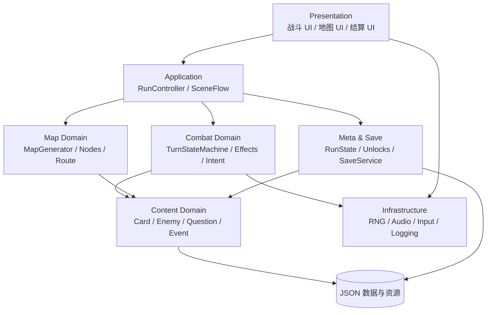
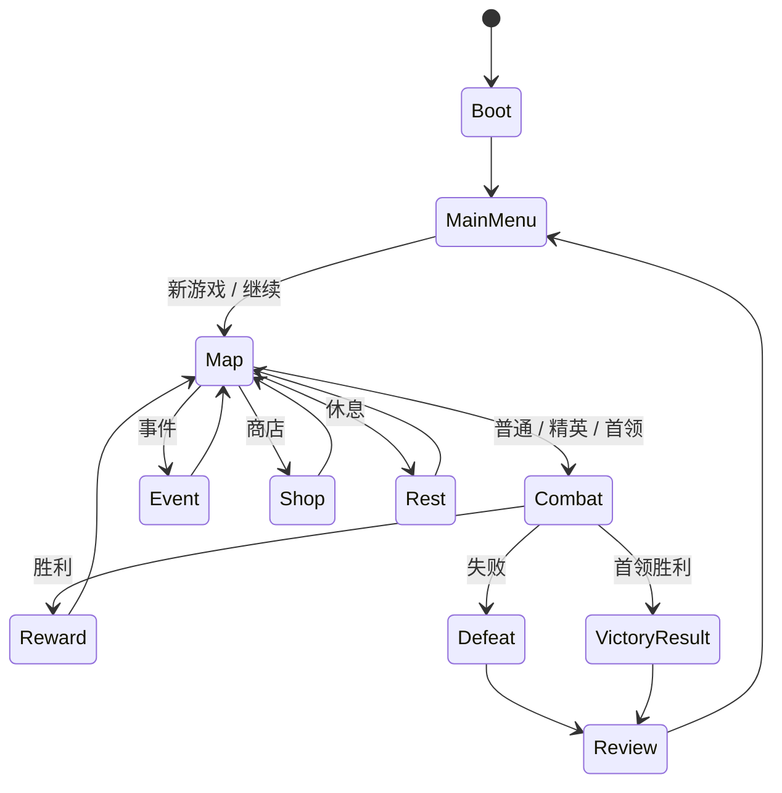

# 《文脉尖塔》TDD

- **文档状态**：Draft v0.1
- **对应 PRD**：[PRD.md](PRD.md)
- **技术与质量收口人**：`tech-quality-lead`
- **首选引擎**：Godot 4.x（首个实现版本固定为 4.4.x；具体 patch 版本记录在项目 ADR 和导出构建信息中）
- **首选语言**：GDScript
- **目标平台**：Windows / macOS

## 1. 技术目标

1. 用数据驱动方式定义卡牌、敌人、题目、遗物和事件，避免把内容写死在战斗代码中。
2. 让战斗规则可复现、可测试、可通过随机种子重放。
3. 让 UI、内容和运行时彼此解耦，便于多个 Agent 并行开发。
4. 先支持单机单局与本地存档，保留扩展章节和题库的接口。

## 2. 总体架构



原则：领域规则不直接操作节点树；UI 通过事件或只读 ViewModel 获取状态；数据资源通过校验后才进入运行时。

## 3. 目录结构

```text
project.godot
game/
  autoload/
    app_state.gd
    event_bus.gd
    save_service.gd
    audio_service.gd
  core/
    ids.gd
    game_result.gd
    rng_service.gd
    weighted_picker.gd
  combat/
    combat_controller.gd
    turn_state_machine.gd
    combat_state.gd
    actor_state.gd
    card_instance.gd
    effect_resolver.gd
    intent_resolver.gd
    status_system.gd
  map/
    map_generator.gd
    map_state.gd
    map_node_state.gd
    route_controller.gd
  content/
    content_repository.gd
    card_definition.gd
    enemy_definition.gd
    question_definition.gd
    relic_definition.gd
    event_definition.gd
  scenes/
    boot/boot.tscn
    menu/main_menu.tscn
    map/map.tscn
    combat/combat.tscn
    event/event.tscn
    shop/shop.tscn
    rest/rest.tscn
    rewards/reward_screen.tscn
    review/review_screen.tscn
  ui/
    cards/
    combat/
    map/
    common/
  data/
    cards/
    enemies/
    questions/
    relics/
    events/
  tests/
    unit/
    integration/
    fixtures/
    test_runner.gd
  fonts/
  localization/
  replays/
build/
  ci/
assets/
  art/
  audio/
tools/
  validate_content.gd
  export_content.gd
  simulate_runs.gd
docs/
  PRD.md
  TDD.md
```

## 4. 运行时场景与模块边界

### 4.1 场景流程



`VictoryResult` 与 `Defeat` 都是 `GameResult` 的结算类型，不额外创建一个可被地图访问的场景；二者复用 `review_screen.tscn` 的结算入口。

### 4.2 Autoload

- `AppState`：当前场景、运行状态、设置和全局服务引用。
- `EventBus`：跨场景信号，如 `card_played`、`question_answered`、`run_ended`。
- `SaveService`：版本化存档、临时运行存档和设置存档。
- `AudioService`：音乐、环境、UI 和战斗音效的分组播放。

Autoload 不保存具体战斗业务规则；业务状态必须由 `RunState`、`CombatState` 等明确对象持有。

## 5. 战斗实现

### 5.1 回合状态机

```text
PLAYER_START
  → DRAW
  → PLAYER_ACTION
      → PLAY_CARD
      → KNOWLEDGE_CHECK（可选）
      → RESOLVE_EFFECT
      → PLAYER_ACTION
  → END_PLAYER_TURN
  → ENEMY_ACTION
  → CLEANUP
  → PLAYER_START
```

`TurnStateMachine` 只负责状态切换和顺序，不负责具体卡牌效果。每个状态提供 `enter()`、`tick()`、`exit()`，并在非法转换时记录错误。题目弹窗是异步暂停：状态机进入 `KNOWLEDGE_CHECK` 后停止玩家输入和回合计时，只接受一次 `answered` 或 `timed_out` 信号；收到后销毁题目上下文，再转入 `RESOLVE_EFFECT`，重复信号必须被忽略。

### 5.2 战斗核心对象

- `CombatState`：回合、能量、抽牌堆、弃牌堆、移除堆、参与者、战斗日志、随机种子。
- `ActorState`：生命、最大生命、护意、状态集合、意图、阵营。
- `CardInstance`：定义 ID、升级等级、临时修正、来源。
- `EffectCommand`：伤害、护意、抽牌、施加状态、费用变化、生成卡牌等原子效果。
- `Intent`：敌人下一步动作的展示数据与执行参数；展示文本和运行时效果分开。
- `QuestionContext`：题目 ID、触发卡、超时、结果和奖励倍率；UI 只接收 `QuestionViewModel`，答案校验由 `QuestionService` 完成。

效果采用命令列表执行：先生成命令，再按顺序解析；禁止卡牌直接修改其他系统的内部字段。每条命令至少包含 `command_id`、`source_id`、`target_snapshot`、`amount`、`tags`、`rng_context` 和 `failure_policy`；目标在执行前快照化，目标已死亡时按策略跳过或转移，不回滚已完成的原子命令。

触发器按固定阶段执行：`before_action` → `on_card_play` → `on_hit / on_damage` → `after_action` → `turn_end` → `on_death`。同一阶段先按优先级，再按稳定 ID 排序；触发器生成的新命令进入当前阶段队列尾部，禁止递归立即重入。

### 5.3 伤害与护意

```text
raw_damage
  → attacker modifiers
  → defender modifiers
  → block absorption
  → hp reduction
  → on_hit / on_damage triggers
```

所有中间值写入战斗日志，便于调试和复盘。整数计算采用向下取整；最小伤害为 0。

### 5.4 知识检定

1. `CardPlayCommand` 读取卡牌定义。
2. 若 `knowledge_check` 存在，暂停玩家行动并创建 `QuestionContext`。
3. `QuestionPresenter` 展示题目；只返回 `correct / wrong / timeout`。
4. `EffectResolver` 按卡牌基础效果和答题结果选择强化倍率。
5. 记录 `question_answered` 事件与知识标签。
6. 恢复 `PLAYER_ACTION`。

题目展示层只接收 `QuestionViewModel`（题干、选项、剩余时间和题目 ID）；答案和战斗状态均由 `QuestionService` 与 `CombatController` 持有，Presenter 不读取或修改领域对象。

## 6. 数据模型

### 6.1 卡牌定义示例

```json
{
  "schema_version": 1,
  "id": "card_word_echo_001",
  "name": "字音回响",
  "cost": 1,
  "type": "attack",
  "rarity": "common",
  "target": "single_enemy",
  "tags": ["字音字形", "连击"],
  "base_effects": [{"op": "damage", "amount": 6}],
  "knowledge_check": {
    "question_pool": "q_phonology_grade7",
    "correct_bonus": [{"op": "apply_status", "status": "洞见", "stacks": 1}],
    "wrong_penalty": [{"op": "apply_status", "status": "疑滞", "stacks": 1}]
  },
  "upgrade": {"base_effects": [{"op": "damage", "amount": 9}]},
  "text": "造成 6 点伤害。答对时获得 1 层洞见。",
  "source": "原创设计",
  "review_status": "approved"
}
```

### 6.2 题目定义示例

```json
{
  "schema_version": 1,
  "id": "q_phonology_0001",
  "grade": "七年级",
  "domain": "字音字形",
  "prompt": "下列词语中加点字读音正确的是？",
  "options": ["选项 A", "选项 B", "选项 C", "选项 D"],
  "answer_index": 1,
  "explanation": "说明声调、声母或词义依据。",
  "difficulty": 2,
  "source": "教材单元 / 自编审核记录",
  "review_status": "approved",
  "reviewer": "content-lead"
}
```

### 6.3 敌人定义示例

```json
{
  "schema_version": 1,
  "id": "enemy_misprint_001",
  "name": "错字魇",
  "max_hp": 42,
  "actions": [
    {"id": "ink_cut", "intent": "attack", "amount": 8, "weight": 60},
    {"id": "blurred_form", "intent": "debuff", "status": "疑滞", "stacks": 1, "weight": 40}
  ],
  "ai_policy": "weighted_intent_with_repeat_guard",
  "reward_tags": ["字音字形"]
}
```

### 6.4 内容校验

导入前必须检查：

- `schema_version` 存在且处于当前支持范围；
- ID 唯一且符合命名规范；
- 引用的卡牌、状态、题库、事件存在；
- 费用、生命和倍率在允许范围；
- 题目有唯一答案、解析、年级、难度、来源和审核状态；
- UI 文本长度不超过对应组件限制；
- 不存在测试占位文本、空数组或未审核内容进入发布包。

`ContentRepository` 启动时先扫描并校验全部内容；单个文件失败时记录文件路径、字段、错误等级和修复建议。开发构建可显示错误列表但继续启动，发布构建遇到错误必须终止。

## 7. 地图生成

Slice A 使用固定层数与可控随机；扩展章节再提高层数：

- Slice A 为 8–10 层，完整章节为 15–18 层；每层 2–4 个节点；
- 首层只出现普通战斗和未知节点；
- 商店、休息点和精英节点按最小间隔约束生成；
- 首领前一层固定为休息点或奖励节点；
- 地图使用 `run_seed` 生成，可由日志重建；
- 生成后执行连通性、重复路线和不可达节点检查。

## 8. 随机与可复现

`RngService` 为地图、战斗、奖励和事件分配独立子流：

```text
run_seed
  ├─ map_rng
  ├─ combat_rng[encounter_id]
  ├─ reward_rng[reward_id]
  └─ event_rng[event_id]
```

首个版本固定使用 Godot `RandomNumberGenerator` 的 seed API；`rng_algorithm_version` 与 seed 一起写入运行状态。子流 seed 由 `hash(run_seed, stream_name, encounter_id)` 派生。每个子流持有 `seed`、`draw_count` 和当前状态快照；若支持战斗中存档，必须保存这些字段。算法版本变更时递增版本号，旧回放只保证读取，不保证跨算法重放。

日志采用 `ReplayEvent`：

```json
{
  "seq": 42,
  "run_id": "run_001",
  "combat_id": "combat_003",
  "event": "card_played",
  "payload": {"card_id": "card_word_echo_001", "target_id": "enemy_misprint_001"},
  "rng_cursor": {"stream": "combat_rng[combat_003]", "draw_count": 12},
  "state_hash": "sha256:..."
}
```

日志必须记录运行种子、战斗 ID、抽牌顺序、敌人意图选择和奖励结果。调试面板支持复制当前种子、查看回放事件和跳过节点。

## 9. 存档

### 9.1 存档内容

- `schema_version`
- `run_id`、`run_seed`、当前章节和地图位置
- 玩家生命、金币、卡组、遗物、升级和知识统计
- 当前抽牌堆、弃牌堆、移除堆和战斗状态（若支持战斗中保存）
- 解锁内容、设置和音量

### 9.2 兼容策略

- 每次改变结构递增 `schema_version`。
- `SaveService` 先迁移再读取；未知字段忽略，缺失字段使用默认值。
- 写入采用临时文件 + 原子替换；保留一个最近备份。
- 存档包含 `checksum`、`created_at` 和 `platform` 字段；单机项目不做加密，但校验失败时拒绝读取。
- 默认保存到 Godot `user://` 路径；存档损坏时显示错误并允许恢复上一份备份，不静默覆盖。
- Slice A 只在节点结算、战斗结束、事件选择完成和商店离开时保存；战斗中不保存，避免保存半结算的异步题目状态。

## 10. UI 与像素渲染

- 逻辑分辨率：640×360；目标窗口 1280×720，窗口缩放使用整数倍优先。该设置遵循 [Godot 多分辨率文档](https://docs.godotengine.org/en/latest/tutorials/rendering/multiple_resolutions.html) 对像素风 viewport、保持宽高比和整数缩放的建议。
- 纹理过滤：Nearest；禁用模糊和非整数缩放造成的采样抖动。
- 像素资产按 1x 原始尺寸导入，不在运行时随意缩放。
- 卡牌、敌人意图和题目面板使用独立场景与主题资源。
- 文字必须提供溢出检测、字体大小选项和不依赖颜色的状态标签。
- 动效优先服务命中、答题反馈和危险提示；避免持续高频闪烁。

## 11. 输入与可访问性

默认绑定：

| 动作 | 鼠标 | 键盘 |
|---|---|---|
| 选择卡牌 | 左键 | 1–0 |
| 结束回合 | 点击按钮 | Space |
| 查看卡牌详情 | 右键 / 长按 | Tab |
| 查看敌人意图 | 悬停 | Shift + 方向键 |
| 取消目标 | 右键 | Esc |

运行时只使用 Godot `InputMap` action，不在组件中直接读取物理按键。首个版本注册：`card_select_1` … `card_select_10`、`end_turn`、`inspect_card`、`inspect_intent`、`cancel_target`、`navigate_left`、`navigate_right`、`confirm`、`back`。数字键映射到手牌排序位置，手牌不足时 action 无效；焦点导航必须覆盖地图节点、卡牌、题目选项和奖励按钮。

设置项：字体大小、文字速度、闪烁强度、音量分组、色盲辅助图标、确认对话框和键位重绑。

## 12. 测试策略

### 单元测试

- 伤害、护意、状态叠加与移除；
- 抽牌、洗牌、弃牌和卡牌移除；
- 费用扣除、非法目标和效果顺序；
- 知识检定的答对、答错、超时；
- 奖励权重、地图连通性和随机种子复现；
- 存档迁移与损坏恢复。

### 集成测试

- 从主菜单开始一局并完成一场战斗；
- 战斗胜利 → 奖励 → 地图；
- 事件选择改变卡组或生命；
- 商店购买与移除卡牌；
- 首领胜利和失败复盘；
- 退出并恢复存档后状态一致。

### 内容与试玩测试

- 题目字段完整、答案唯一、解析可读；
- 卡牌文本与实际效果一致；
- 20 局种子测试检查三种流派的可行性；
- 试玩者能在 60 秒内理解战斗基本操作；
- 检查目标分辨率下的截断、遮挡和输入焦点。

### 自动化入口与阈值

- 单元与集成测试入口：`godot --headless --path . -s tests/test_runner.gd`。
- 固定种子跑局入口：`godot --headless --path . -s tools/simulate_runs.gd --seeds 10`。
- Slice A 的 10 个固定种子至少 7 个能到达首领战；至少 6 个能完成首领战，低于阈值则阻断扩容。
- 发布构建必须零阻断级缺陷；题库校验错误为阻断级；非阻断视觉问题可以进入已知问题清单。

## 13. 调试与工具

- 内容校验器：扫描 JSON、引用、题目字段和审核状态。
- 卡牌沙盒：选择卡牌、敌人、初始状态和知识结果，单步执行效果。
- 地图预览器：输入种子，展示节点、路线和约束错误。
- 跑局模拟器：批量运行固定种子，导出胜率、平均伤害、奖励选择和知识正确率。
- 战斗日志：支持复制为 JSON，能在本地重放关键事件。

## 14. 性能与构建目标

- 目标帧率：60 FPS；战斗场景常态帧时间低于 16.6 ms。
- 首个切片内存目标：桌面端常态低于 512 MB。
- 场景切换：地图、战斗、结算界面在本地机器上 1 秒内完成。
- 所有发布构建在无编辑器环境可启动；构建前自动执行内容校验和测试。

## 15. 开发顺序

1. `tech-lead` 建立工程、目录、数据 schema 和日志。
2. `gameplay-engineer` 实现抽牌、费用、效果解析和回合状态机。
3. `content-data-curator` 导入 10 张卡、1 个题库和 1 个敌人。
4. `ui-ux-designer` 实现战斗信息、题目面板和奖励选择。
5. `map-event-designer` 与 `gameplay-engineer` 接通路线和节点。
6. `pixel-artist-animator` 替换占位资源，`audio-feedback-designer` 接入关键反馈。
7. `qa-playtest-analyst` 执行集成测试、固定种子试玩和内容复核。
8. `tech-quality-lead` 汇总阻断问题，向 `producer-director` 提交版本决策包。

## 16. 技术风险

| 风险 | 应对 |
|---|---|
| 卡牌效果组合导致顺序 Bug | 所有效果使用命令队列；记录每个命令的输入和输出 |
| 题库内容进入运行时后才发现错误 | 导入前校验；`review_status != approved` 不允许打包 |
| 随机问题无法复现 | 分离 RNG 子流；保存种子和关键日志 |
| UI 与像素资源比例不一致 | 固定逻辑分辨率、Nearest 过滤和组件尺寸规范 |
| 数据结构变化破坏旧存档 | schema 版本、迁移函数和备份恢复 |
| 需求不断扩大 | 以 PRD 垂直切片通过条件作为版本门槛 |
